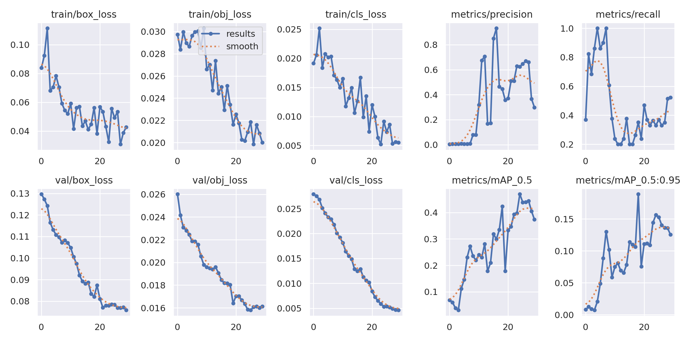
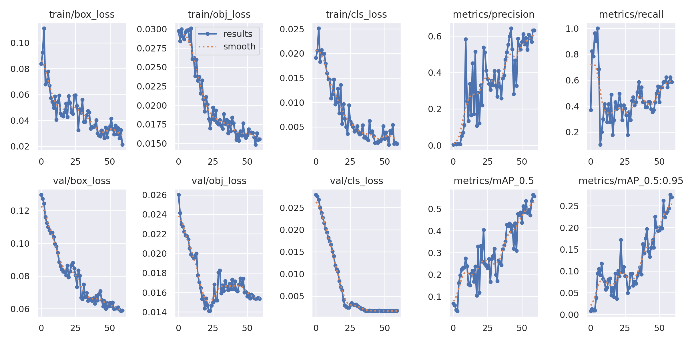
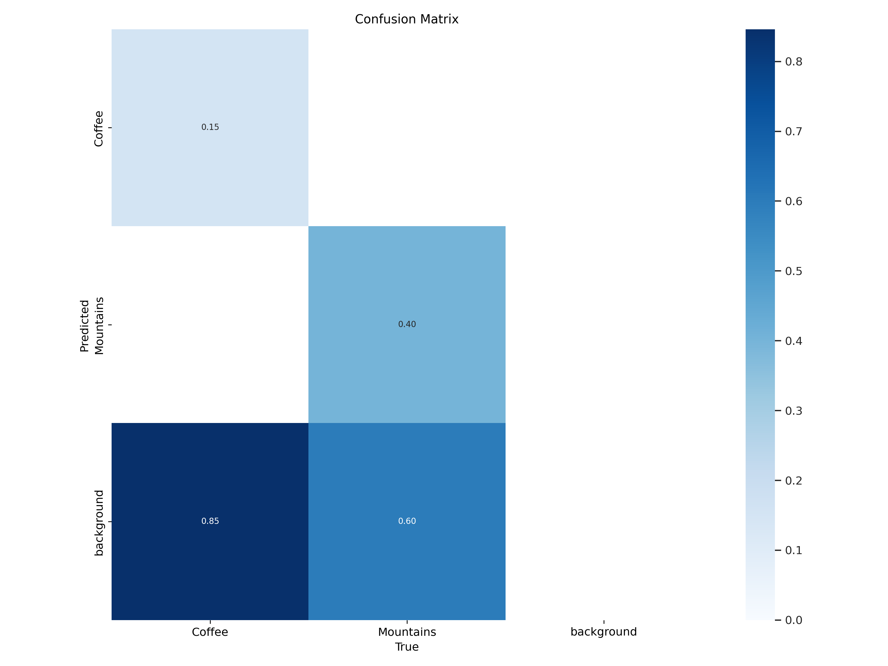
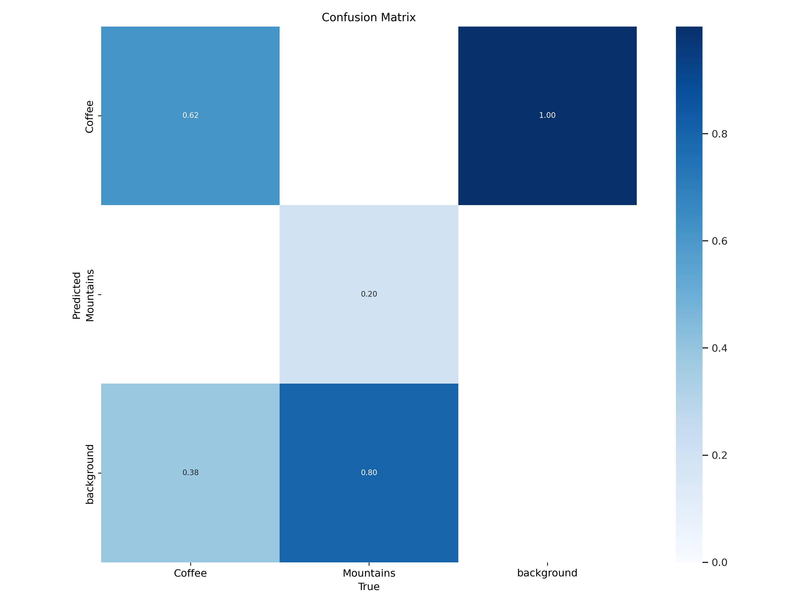
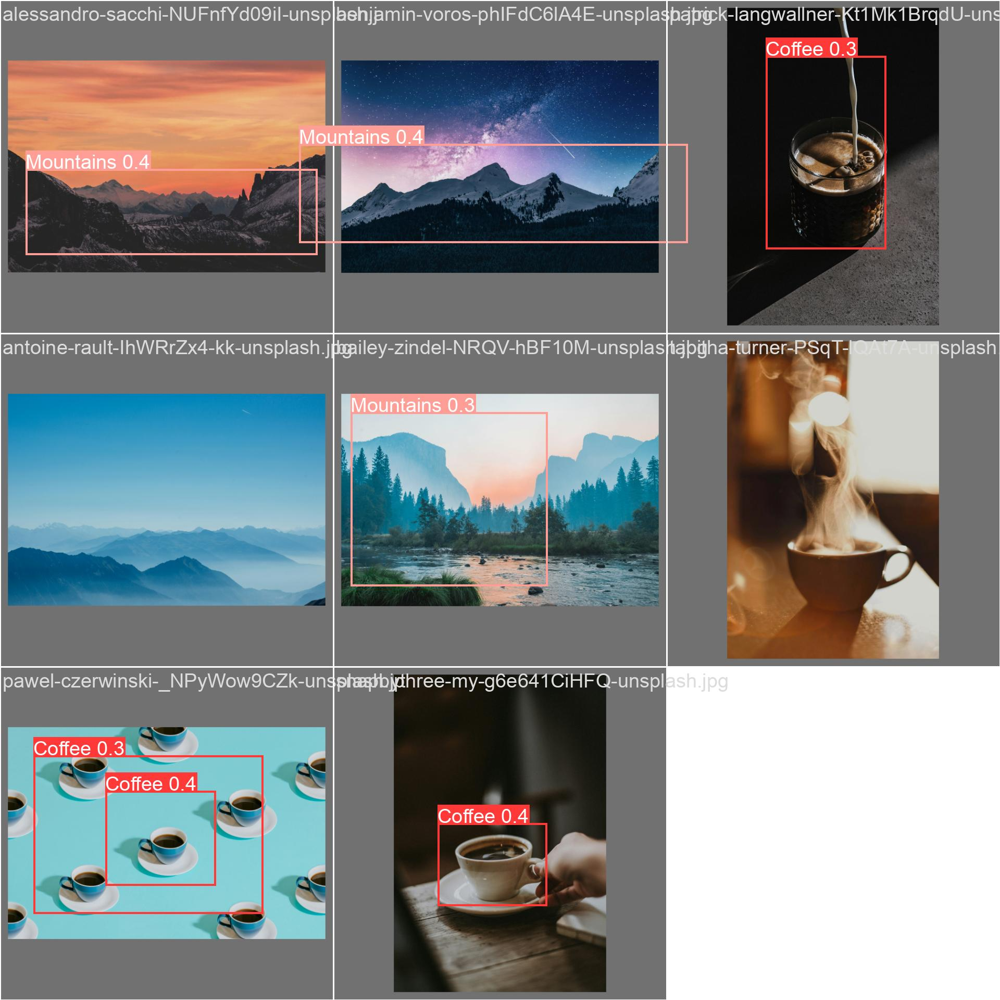
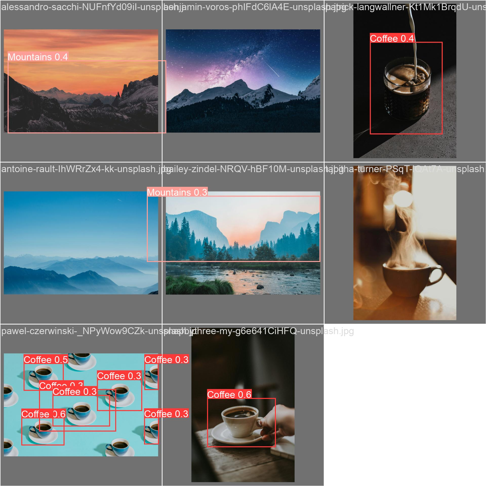

# Cap_1_despertar_da_rede_neural_entrega_1
# 🌾 Detecção de Objetos com YOLO - FarmTech Solutions


## 📋 Sobre o Projeto

Este projeto foi desenvolvido como trabalho acadêmico para demonstrar a aplicação de técnicas de Deep Learning na detecção de objetos utilizando o modelo **YOLOv5**. O objetivo é criar um sistema de detecção automatizada para a empresa fictícia **FarmTech Solutions**, aplicando visão computacional em contextos agrícolas.

## 🎯 Objetivos

- ✅ Treinar modelos YOLO com diferentes configurações de épocas
- ✅ Comparar o desempenho entre modelos (30 vs 60 épocas)
- ✅ Avaliar métricas de acurácia, precisão e recall
- ✅ Validar e testar os modelos em dados não vistos
- ✅ Demonstrar aplicação prática com imagens de teste

## 🛠️ Tecnologias Utilizadas

- **Python 3.8+**
- **YOLOv5** (Ultralytics)
- **PyTorch**
- **Google Colab** (com GPU)
- **Pandas** para análise de dados
- **Matplotlib** para visualizações
- **OpenCV** para processamento de imagens

## 📁 Estrutura do Projeto

```
projeto-yolo-farmtech/
├── notebook/
│   └── YOLO_Training_Complete.ipynb    # Notebook principal com todo o pipeline
├── dataset/
│   ├── data.yaml                        # Configuração do dataset
│   ├── train/                           # Dados de treinamento
│   │   ├── images/
│   │   └── labels/
│   ├── valid/                           # Dados de validação
│   │   ├── images/
│   │   └── labels/
│   └── test/                            # Dados de teste
│       ├── images/
│       └── labels/
├── results/
│   ├── exp_30_epochs/                   # Resultados com 30 épocas
│   │   ├── weights/
│   │   ├── results.png
│   │   └── confusion_matrix.png
│   └── exp_60_epochs/                   # Resultados com 60 épocas
│       ├── weights/
│       ├── results.png
│       └── confusion_matrix.png
└── README.md
```

## 🚀 Como Usar

### 1️⃣ Preparação do Ambiente

```bash
# Clone o repositório YOLOv5
!git clone https://github.com/ultralytics/yolov5
%cd yolov5

# Instale as dependências
!pip install -r requirements.txt
```

### 2️⃣ Monte seu Google Drive

```python
from google.colab import drive
drive.mount('/content/drive')
```

### 3️⃣ Configure o caminho do dataset

Edite o arquivo `data.yaml` com os caminhos corretos:

```yaml
train: /content/drive/MyDrive/seu_dataset/train/images
val: /content/drive/MyDrive/seu_dataset/valid/images
test: /content/drive/MyDrive/seu_dataset/test/images

nc: 2  # número de classes
names: ['classe1', 'classe2']  # nomes das suas classes
```

### 4️⃣ Execute o Treinamento

#### Treinamento com 30 épocas:
```bash
python train.py \
    --img 640 \
    --batch 16 \
    --epochs 30 \
    --data data.yaml \
    --weights yolov5s.pt \
    --name exp_30_epochs \
    --cache
```

#### Treinamento com 60 épocas:
```bash
python train.py \
    --img 640 \
    --batch 16 \
    --epochs 60 \
    --data data.yaml \
    --weights yolov5s.pt \
    --name exp_60_epochs \
    --cache
```

### 5️⃣ Validação

```bash
python val.py \
    --weights runs/train/exp_30_epochs/weights/best.pt \
    --data data.yaml \
    --img 640
```

### 6️⃣ Teste em Novas Imagens

```bash
python detect.py \
    --weights runs/train/exp_60_epochs/weights/best.pt \
    --source path/to/test/images \
    --img 640 \
    --conf 0.25
```

## 📊 Resultados Obtidos

### Comparação de Desempenho

| Métrica | 30 Épocas | 60 Épocas | Melhora |
|---------|-----------|-----------|---------|
| **Precisão** | 29.88% | 63.22% | +112% 🚀 |
| **Recall** | 52.31% | 58.46% | +12% |
| **mAP@0.5** | 37.34% | 55.80% | +49% |
| **mAP@0.5:0.95** | 12.54% | 27.00% | +115% 🚀 |

### Análise de Loss

| Loss | 30 Épocas | 60 Épocas | Redução |
|------|-----------|-----------|---------|
| **Train Box Loss** | 0.042803 | 0.021246 | -50% |
| **Train Obj Loss** | 0.019994 | 0.015546 | -22% |
| **Val Box Loss** | 0.075847 | 0.058971 | -22% |

### 📈 Gráficos de Treinamento




<p align="center">
  
  
</p>

*Evolução das métricas durante o treinamento: 30 épocas (esquerda) vs 60 épocas (direita)*

### 🎯 Matriz de Confusão




<p align="center">
  
  
</p>

### 🖼️ Exemplos de Detecções




<p align="center">
  
  
</p>

## 💡 Conclusões

### ✅ Principais Descobertas

1. **Impacto das Épocas**: O aumento de 30 para 60 épocas resultou em melhorias significativas em todas as métricas, especialmente na precisão (+112%).

2. **Ausência de Overfitting**: As losses de validação continuaram diminuindo junto com as de treinamento, indicando que o modelo ainda tinha capacidade de aprendizado.

3. **Precisão vs Recall**: O modelo de 60 épocas apresentou melhor equilíbrio, sendo mais adequado para aplicações onde falsos positivos são críticos.

4. **Tempo vs Desempenho**: Embora o treinamento com 60 épocas leve o dobro do tempo, o ganho substancial em performance justifica o investimento.

### 🎯 Recomendações para FarmTech Solutions

- **Modelo Recomendado**: 60 épocas (ou mais)
- **Próximos Passos**:
  - Testar com 100+ épocas para verificar limite de melhoria
  - Experimentar modelos maiores (YOLOv5m, YOLOv5l)
  - Aumentar dataset com data augmentation
  - Ajustar hiperparâmetros (learning rate, batch size)

### 📉 Limitações Identificadas

- Dataset relativamente pequeno pode limitar a generalização
- mAP@0.5:0.95 ainda tem espaço para melhoria (27%)
- Necessário mais testes em condições variadas de iluminação

## 🔮 Trabalhos Futuros

- [ ] Implementar data augmentation
- [ ] Testar ensemble de modelos
- [ ] Otimizar para inferência em tempo real
- [ ] Deploy em edge devices (Raspberry Pi, Jetson Nano)
- [ ] Integração com sistema de alerta automático

## 👥 Equipe

- **[Seu Nome]** - Desenvolvimento e Treinamento
- **[Nome do Colega]** - Preparação do Dataset
- **[Outros Membros]** - Análise e Documentação

## 📚 Referências

- [YOLOv5 Official Repository](https://github.com/ultralytics/yolov5)
- [YOLOv5 Documentation](https://docs.ultralytics.com/)
- Redmon, J., & Farhadi, A. (2018). YOLOv3: An Incremental Improvement
- Jocher, G. (2020). YOLOv5: A State-of-the-Art Real-Time Object Detection

## 📄 Licença

Este projeto está sob a licença MIT. Veja o arquivo [LICENSE](LICENSE) para mais detalhes.

## 📞 Contato

Para dúvidas ou sugestões sobre o projeto:

- **Email**: seu.email@exemplo.com
- **LinkedIn**: [Seu Perfil](https://linkedin.com/in/seu-perfil)
- **GitHub**: [@seu-usuario](https://github.com/seu-usuario)

---

<p align="center">
  Feito com ❤️ e ☕ para FarmTech Solutions
</p>

<p align="center">
  <sub>Projeto Acadêmico - [Nome da Universidade] - 2024</sub>
</p>
